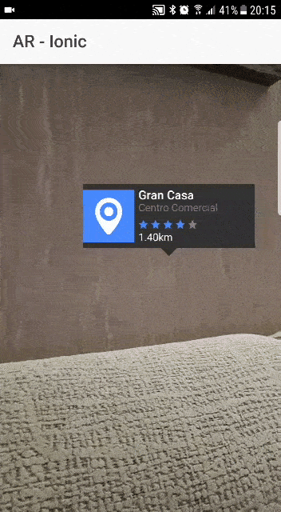

# AR-Ionic

Calcula la distancia en tiempo real desde tu ubicacion a distintos POI's y muestra un marker encima de dicho POI en Realidad Aumentada

Puro **Ionic + HTML + CSS** (Ninguna librería externa necesaria)

### INSTALL

    npm install
    ionic cordova run <android/ios>

---

### DEPENCENCIES

cli packages: (/usr/local/lib/node_modules)

    @ionic/cli-utils  : 1.19.1
    ionic (Ionic CLI) : 3.19.1
    cordova (Cordova CLI) : 8.0.0

System:

    Android SDK Tools : 26.1.1
    ios-deploy        : 1.9.2
    Node              : v6.9.5
    npm               : 3.10.10
    OS                : OS X El Capitan
    Xcode             : Xcode 8.2.1 Build version 8C1002

---

[jorgecoke.github.io](https://jorgecoke.github.io)